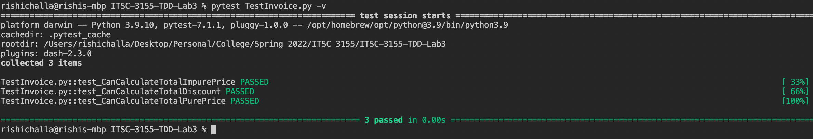
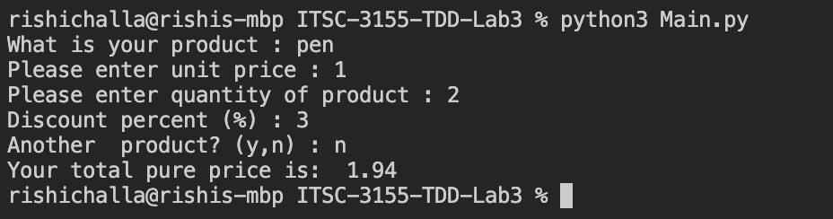

# ITSC-3155-TDD-Lab3
ITSC 3155 Test Driven Dev Lab 3

1. You need to provide screenshots of the GitHub repository for this code as well as the link(URL) to that.

https://github.com/rchalla2/ITSC-3155-TDD-Lab3 

2. You need to provide screenshots of the test results (from PyCharm Terminal).

(Using VSCode) -


3. In TDD, how do we design a new test case? (Try to generalize what you learned in this activity.)

Design the test case based on the intended functionality for the code. For example in a C++ Game Engine using CTest, you may want a unit test to check a collision detection module. You'd want a separate collision test not only for every type of geometry capable of colliding but also every possible arithmetic scenario. For example with a ray-ray collision you'd want to account for both rays being parallel and create a separate test for it.

4. In this particular example, can you think about another new test case which could have been a new feature to be visualized based on customer request? You can brainstorm with your group and get help from TA’s.

```python
def test_CanCalculateTax(invoice, products, taxrate):
	assert invoice.totalTax(products, taxrate) == 0.34
```

Calculating tax rates may be a feature which could be added.

5. You need to provide a screenshot of output when you Run Main.py (as depicted in Figure 17)

(Using VSCode) -

